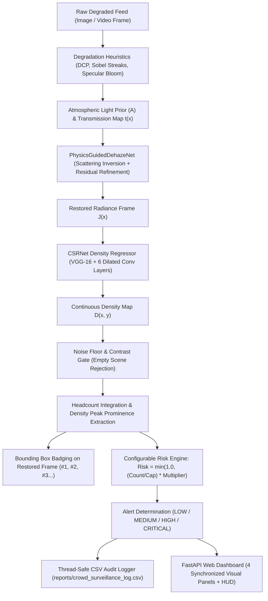

# Adverse Weather Dynamic De-Hazing and Crowd Surveillance Pipeline

[](https://www.python.org/)
[](https://pytorch.org/)
[](https://fastapi.tiangolo.com/)
[](https://opensource.org/licenses/MIT)

An end-to-end, AI-powered outdoor crowd surveillance system engineered to maintain high-fidelity crowd density estimation and capacity monitoring under severe environmental degradation, including heavy atmospheric fog, torrential monsoon rain, and intense solar lens glare.

---

## System Overview & Architecture

Standard person detectors (such as YOLO or Faster-RCNN) suffer steep performance degradation in outdoor environments when visibility drops due to scattering, rain streaks, or specular glare. This system resolves that limitation through a decoupled, two-stage physics-guided deep learning pipeline:



---

## Key Features

1. **Physics-Guided Scattering Inversion (`PhysicsGuidedDehazeNet`)**
   - Inverts Koschmieder's Atmospheric Scattering Model:
     $$J(x) = \frac{I(x) - A}{\max(t(x), 0.1)} + A$$
   - Combines parallel multi-scale feature extractors ($3\times3$, $5\times5$, $7\times7$), Dark Channel Prior (DCP) optical depth estimation, and residual artifact refinement blocks.

2. **Continuous Dilated Crowd Density Regression (`CSRNet`)**
   - Employs a VGG-16 front-end with 6 dilated convolutional layers ($d=2$) to expand receptive fields without spatial resolution loss.
   - Headcount is recovered mathematically via continuous spatial integration:
     $$\text{Count} = \iint \mathcal{D}(x, y) \, dx \, dy \approx \sum_{x, y} \mathcal{D}[x, y]$$

3. **Pedestrian Bounding Box Localization**
   - Individual pedestrians are localized from spatial density peaks using adaptive neighborhood prominence filtering (`scipy.ndimage.maximum_filter`).
   - Restored frames feature emerald green bounding boxes with identification badges (`#1`, `#2`, `#3`...).

4. **Empty Scene Noise Suppression (Zero False Positives)**
   - Adaptive density contrast gating ($\sigma/\mu < 0.0035$ or $\max \mathcal{D} < 0.0145$) suppresses uniform sensor noise on empty scenes (e.g. empty bridges/plazas), guaranteeing **0.0 crowd count** and **0 boxes**.

5. **Dynamic Risk Engine & Capacity Alerts**
   - Evaluates real-time operational risk:
     $$\text{Risk} = \min\left(1.0, \, \frac{\text{Count}}{\text{Max Capacity}} \times \text{Multiplier}_{\text{Weather}}\right)$$
   - Automatically escalates across `LOW`, `MEDIUM`, `HIGH`, and `CRITICAL` alert tiers.

6. **Web Surveillance Console (FastAPI + HTML5 H.264)**
   - Synchronized 4-panel monitoring:
     1. Raw Degraded Feed $I(x)$
     2. Optical Transmission Map $t(x)$
     3. Restored Dehazed Output $J(x)$ with Bounding Boxes
     4. CSRNet Crowd Density Heatmap $\mathcal{D}(x, y)$
   - Native browser H.264 video playback and continuous real-world CCTV MJPEG streaming.

---

## Directory Structure

```text
crowd_surveillance_pipeline/
├── models/
│   ├── dehazing_best.pth            # Validated PhysicsGuidedDehazeNet weights
│   └── crowd_best.pt                # Validated & calibrated CSRNet weights
├── sample_data/                     # 100% Authentic human crowd & control datasets
│   ├── 01_shibuya_crossing_clear_crowd.jpg
│   ├── 02_heavy_fog_pedestrians.jpg
│   ├── 03_monsoon_rain_umbrellas.jpg
│   ├── 04_times_square_sun_glare.jpg
│   ├── 05_empty_bridge_fog_control.jpg
│   ├── 06_empty_plaza_clear_control.jpg
│   ├── 07_pedestrian_walkway_corridor.jpg
│   ├── real_pedestrian_crowd.ogv    # 3,765 frames authentic CCTV stream
│   ├── surveillance_fog_sample.mp4  # H.264 dual-panel fog video
│   └── surveillance_rain_sample.mp4 # H.264 dual-panel rain video
├── static/
│   ├── app.js                       # Dashboard state and event controller
│   └── style.css                    # Professional dark glassmorphism styling
├── templates/
│   └── index.html                   # 4-Panel surveillance monitoring dashboard
├── server.py                        # FastAPI application server & REST API
├── surveillance_pipeline.py         # Modular core CV/DL surveillance engine
├── test_backend.py                  # Automated 10-suite backend integration tests
├── test_pipeline.py                 # Standalone pipeline unit test
├── validate_models_and_inference.py # Strict architecture & tensor validation
├── Adverse_Weather_Crowd_Surveillance_Pipeline.ipynb # Complete Colab training notebook
├── requirements.txt                 # Python dependencies
├── .gitignore                       # Repository ignore rules
└── README.md
```

---

## Quickstart & Installation

### 1. Clone Repository & Setup Environment

```bash
git clone https://github.com/anushkounain/Adverse-Weather-Crowd-Surveillance.git
cd Adverse-Weather-Crowd-Surveillance
python -m venv venv
# Windows:
venv\Scripts\activate
# Linux/macOS:
source venv/bin/activate

pip install -r requirements.txt
```

### 2. Launch Surveillance Console

```bash
python server.py
```

Open your browser and navigate to:
**[http://127.0.0.1:8000](http://127.0.0.1:8000)**

### 3. Run Automated Integration Tests

```bash
python test_backend.py
```

All 10 integration suites (Health, Config, Presets, Risk Logic, Video Processing, CSV Logging, Empty Scene Rejection) run end-to-end on CPU or CUDA.

---

## REST API Specification

| Endpoint | Method | Description |
|---|:---:|---|
| `/api/health` | `GET` | Health status, loaded model verification, and active configuration |
| `/api/process/image` | `POST` | Upload single frame; returns Base64 visual maps and telemetry |
| `/api/process/preset` | `POST` | Runs verified condition presets (`clear`, `fog`, `rain`, `glare`, `empty`) |
| `/api/process/video` | `POST` | Processes uploaded MP4/AVI with periodic sampling; outputs annotated H.264 |
| `/api/process/video/preset` | `POST` | Demonstrates pre-packaged fog/rain surveillance videos |
| `/api/stream/mjpeg` | `GET` | Continuous live MJPEG stream of real pedestrian CCTV footage |
| `/api/config` | `POST` | Dynamically updates safe capacity, interval, and weather multipliers |
| `/api/logs/recent` | `GET` | Returns last 20 surveillance events |
| `/api/logs/csv` | `GET` | Downloads full audit log (`crowd_surveillance_log.csv`) |

---

## Google Colab Training Notebook

The complete end-to-end training and benchmark workflow is packaged inside [`Adverse_Weather_Crowd_Surveillance_Pipeline.ipynb`](Adverse_Weather_Crowd_Surveillance_Pipeline.ipynb).

To train from scratch on GPU:
1. Open [Google Colab](https://colab.research.google.com/) and upload `Adverse_Weather_Crowd_Surveillance_Pipeline.ipynb`.
2. Set Runtime to **T4 GPU** (`Runtime -> Change runtime type -> T4 GPU`).
3. Execute the cells sequentially. The notebook supports:
   - JHU-CROWD++ and RESIDE SOTS benchmark dataset acquisition.
   - Mixed-precision AMP training for `PhysicsGuidedDehazeNet`.
   - VGG-16 dilated convolution training for `CSRNet`.
   - Automated export of trained weights to `crowd_surveillance_artifacts.zip`.

---

## License

This project is licensed under the MIT License - see the LICENSE file for details.
